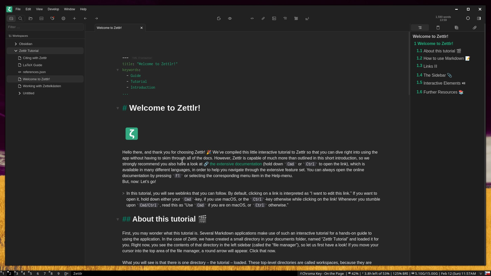

# Zettlr dark theme
This is a theme for the text editor Zettlr. It is made with the intent of being easy on the eyes and removing the purple undertones of the default dark theme.

This theme is inteded to be used with the dark theme option enabled and with the File Manager mode set to Combined.

## How to install
- navigate to the raw style.css file in this repository
- copy the css into your clipboard
- open File > Preferences > Assets Manager in Zettlr
- navigate to Custom CSS and paste the css code inside of the input field
- click Save
